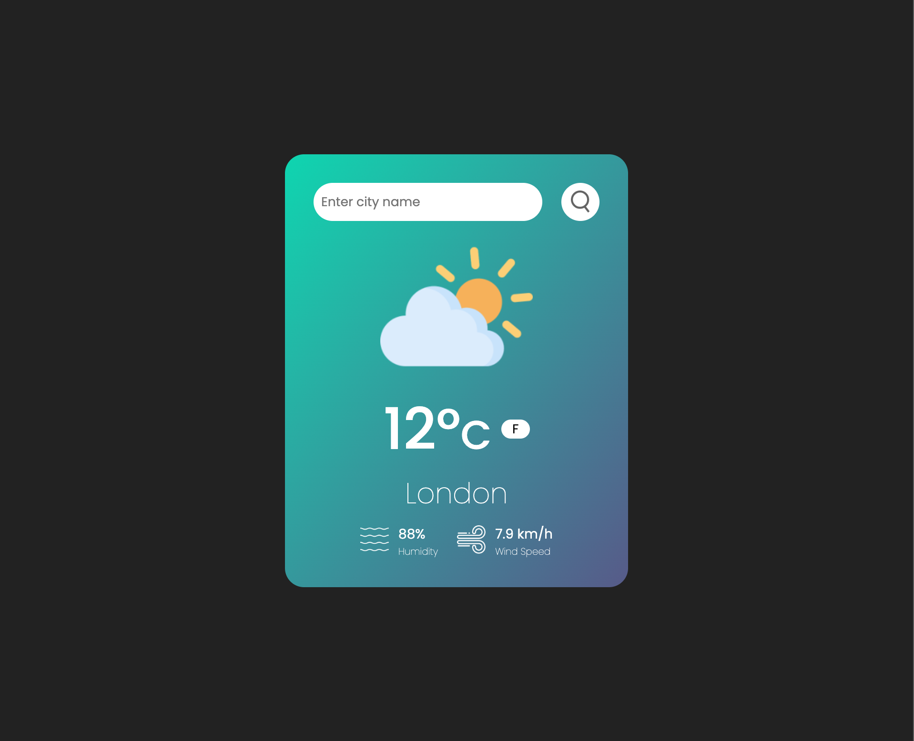

# 🌤️ Weather App

A modern and responsive **Weather Application** that allows users to search for any city and get real-time weather data using the WeatherAPI.

---

## 📸 Preview



---

## ✨ Features

- 🔍 Search weather by city name
- 🌡️ Toggle between **Celsius (°C)** and **Fahrenheit (°F)**
- 🌤️ Dynamic weather icons based on conditions
- 💧 Displays humidity levels
- 🌬️ Shows wind speed
- ⚠️ Error handling for invalid city searches
- ⚡ Fast and lightweight UI
- 📱 Fully responsive design

---

## 🧠 How It Works

1. User enters a city name
2. App sends a request to the WeatherAPI
3. Weather data is fetched asynchronously using `fetch()`
4. UI updates dynamically with:
   - Temperature
   - Weather condition
   - Humidity
   - Wind speed

---

## 🛠️ Tech Stack

- **HTML5** – Structure
- **CSS3** – Styling & responsiveness
- **JavaScript (ES6)** – Logic & API handling
- **WeatherAPI** – Real-time weather data

---

## 📂 Project Structure

```bash
Weather-App/
│── index.html
│── style.css
│── script.js
│── assets/
│   └── images/
```

---

## ⚙️ Installation & Setup

### 1. Clone the repository

```bash
git clone git@github.com:Codezzoom/Weather-App.git
cd Weather-App
```

### 2. Open the project

- Open `index.html` in your browser
  **OR**
- Use VS Code Live Server

---

## 🔑 API Configuration

This project uses **WeatherAPI**.

Replace your API key in `script.js`:

```js
const API_KEY = "YOUR_API_KEY";
```

⚠️ **Important:**
Never expose your API key in public repositories.
Use `.env` or backend services for production apps.

---

## 🧪 Example Use Case

- Search: `London`
- Output:
  - Temperature: 18°C
  - Condition: Cloudy
  - Humidity: 65%
  - Wind: 12 kph

---

## 📈 Future Improvements

- 📅 5-day / hourly forecast
- 📍 Detect user location automatically (Geolocation API)
- 🎨 Improved UI animations
- 🌙 Dark mode support
- 🔄 Loading spinner while fetching data
- 🧭 Better weather condition mapping

---

## 🤝 Contributing

Contributions are welcome!

1. Fork the repo
2. Create a new branch
3. Make your changes
4. Submit a Pull Request

---

## 📜 License

This project is licensed under the MIT License.

---

## 👨‍💻 Author

**Amrit**
GitHub: https://github.com/Codezzoom

---

## ⭐ Support

If you like this project, give it a ⭐ on GitHub!
